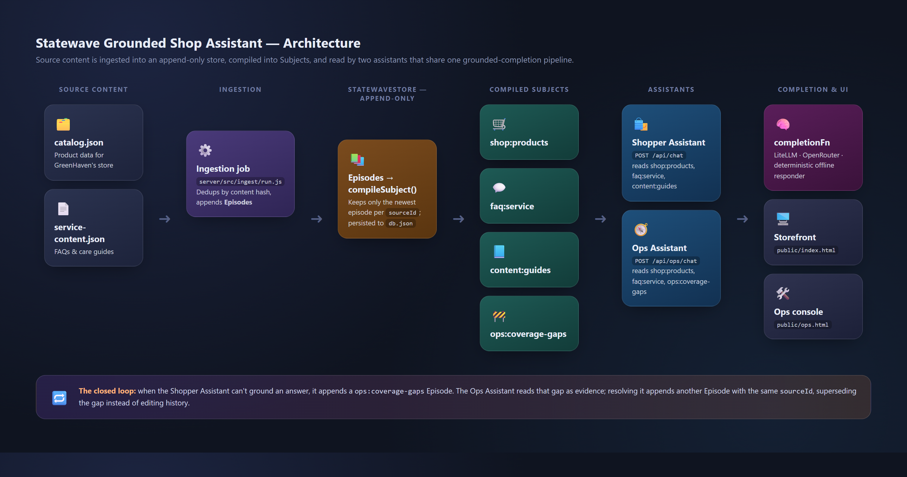
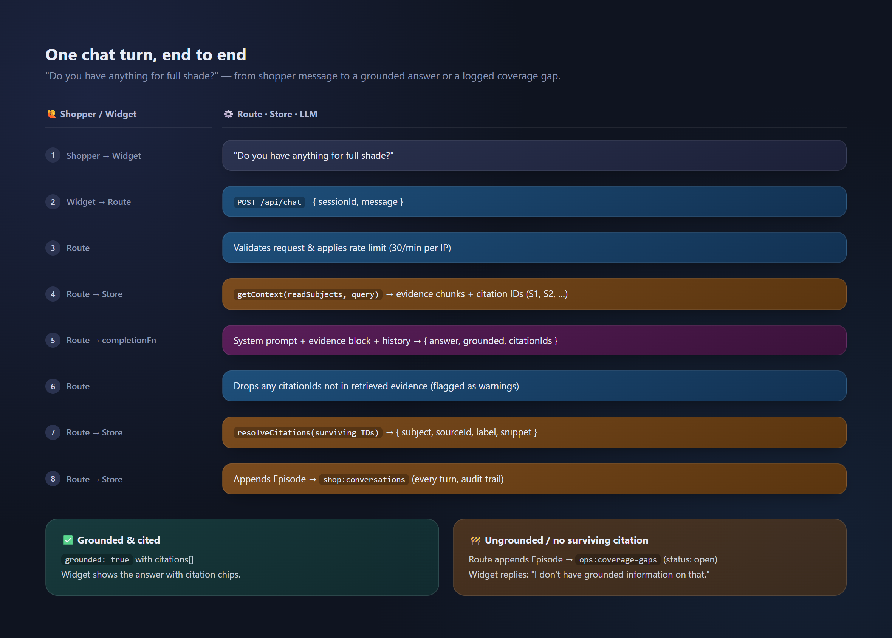

# Statewave Grounded Shop Assistant


[](https://github.com/smaramwbc/statewave-grounded-shop-assistant/actions/workflows/ci.yml)
[](#getting-started)
[](LICENSE)

A runnable use case for **Statewave**: a grounded product advisor and support
assistant for a fictional garden & outdoor-living store ("GreenHaven"), plus
an internal **Ops Assistant** that closes the loop on content gaps.

Every answer the shopper-facing assistant gives is grounded in retrieved
evidence (Episodes -> compiled Subjects) and cited back to its source. If the
assistant can't find grounded evidence for a question, it says so instead of
guessing, and the gap is automatically logged so the content team can fix it.

The whole demo runs **with zero setup and no API key**, using a deterministic
offline responder. Point it at an LLM gateway to get real LLM-generated
answers instead (any OpenAI-compatible provider works, see
[Enabling real LLM-generated answers](#enabling-real-llm-generated-answers)).

> **Part of [Statewave](https://github.com/smaramwbc/statewave)** — the open-source memory runtime for AI agents.
>
> 📦 [Core runtime](https://github.com/smaramwbc/statewave) · 🐍 [Python SDK](https://github.com/smaramwbc/statewave-py) · 🟦 [TypeScript SDK](https://github.com/smaramwbc/statewave-ts) · 🔌 [Connectors](https://github.com/smaramwbc/statewave-connectors) · 📘 [Docs](https://github.com/smaramwbc/statewave-docs) · 💡 [Examples](https://github.com/smaramwbc/statewave-examples) · 🖥️ [Admin](https://github.com/smaramwbc/statewave-admin) · 🌐 [statewave.ai](https://statewave.ai)
>
> 📋 **Issues & feature requests:** [statewave/issues](https://github.com/smaramwbc/statewave/issues) (centralized tracker) — Issues are disabled on this repo so all reports funnel to one place.

---

## Why this exists

This repo mirrors the real Statewave integration contract (`Episode` ->
`compileSubject` -> `getContext` -> grounded completion -> `resolveCitations`)
using a local, self-contained implementation, so you can see the whole
pattern end-to-end without a Statewave server or any external service:

- **Grounded answers only.** The model is instructed to answer strictly from
  retrieved evidence and to say it doesn't know rather than hallucinate.
- **Every claim is citable.** Citation IDs returned by the model are
  validated against the evidence that was actually retrieved; unknown IDs are
  dropped and flagged as a warning.
- **Content gaps are a first-class object.** When the shopper assistant can't
  answer, a `Coverage gap` episode is written automatically. The Ops
  Assistant reads those gaps (plus the product catalog and FAQs) so the
  content team can ask "what needs fixing this week?" and get a grounded,
  cited answer, then resolve the gap from the same UI.
- **Append-only memory.** Nothing is mutated in place. Ingesting an updated
  product, or resolving a coverage gap, appends a new `Episode` with the same
  `sourceId`; `compileSubject` keeps only the newest episode per source, so
  updates supersede facts instead of duplicating or editing history.

## How it works




The thick edges are the closed loop: a question the shopper assistant *can't*
ground becomes a `ops:coverage-gaps` Episode, which the Ops Assistant reads as
evidence, and resolving it appends another Episode with the same `sourceId`.

### One chat turn, end to end



**Subjects** used in this demo:

| Subject | Written by | Read by |
|---|---|---|
| `shop:products` | ingestion job (`catalog.json`) | shopper + ops assistants |
| `faq:service` | ingestion job (`service-content.json`) | shopper + ops assistants |
| `content:guides` | ingestion job (`service-content.json`, `guide-*` docs) | shopper assistant |
| `ops:coverage-gaps` | shopper route, on an ungrounded answer | ops assistant, `/api/ops/gaps` |
| `shop:conversations` | shopper route, every turn | (audit trail) |
| `ops:conversations` | ops route, every turn | (audit trail) |

## Project layout

```
packages/
  statewave-core/   Local implementation of the Statewave memory-runtime
                     contract: Episodes -> compiled Subjects -> getContext().
                     Content-hash idempotent, JSON-file persisted.
  chat-core/         Framework-independent grounded-chat engine: retrieval,
                     prompt construction, citation validation. LLM-agnostic
                     via a completionFn, this repo wires up an LLM gateway
                     and an offline rule-based fallback
                     (packages/chat-core/src/completion/).
  chat-widget/       Drop-in vanilla-TS chat UI. Compiled to plain JS
                     (`npm run build:widget`, wired into `dev`/`start`
                     automatically) and served as a static ES module —
                     no bundler required to clone-and-run this demo.
server/
  src/index.ts       Express app: serves the storefront, the ops console,
                      the widget's compiled JS, and both /api/* route groups.
  src/routes/chat.ts  Shopper-facing /api/chat, the only part of the repo
                      that holds an LLM key; writes coverage gaps on misses.
  src/routes/ops.ts   Ops-facing /api/ops/chat, /api/ops/gaps, and gap
                      resolution.
  src/ingest/run.ts   Reads catalog.json + service-content.json, writes
                      Episodes. Safe to re-run (deduped by content hash).
  data/               catalog.json, service-content.json (source content) and
                      db.json (generated store, gitignored, rebuilt on boot).
public/
  index.html          Storefront demo page, mounts the shopper chat widget.
  ops.html            Internal Ops console, mounts the ops chat widget.
```

## Getting started

Requires Node.js 18+.

```bash
npm install
npm run dev
```

Then open:

- **Storefront:** http://localhost:4000/
- **Ops console:** http://localhost:4000/ops.html

On first boot, if the store is empty, the ingestion job runs automatically,
there's no separate setup step. On every boot after that it's a no-op
(everything is already ingested and deduped).

That's it, no API key required. The assistant runs in
`offline-rule-based` completion mode by default, which is deterministic and
good enough to see grounding, citations, and the coverage-gap loop in action.

### Enabling real LLM-generated answers

```bash
cp .env.example .env
```

Then set in `.env`, pointing at an LLM gateway of your choice:

```
OPENROUTER_API_KEY=your-key-here
OPENROUTER_MODEL=openai/gpt-4o-mini   # optional, this is the default
```

(Any OpenAI-compatible gateway works here, not just this one — see below
for wiring up a different one.)

Restart `npm run dev`. The server logs which completion mode is active, and
`GET /healthz` reports it too.

#### Using a different gateway (e.g. LiteLLM)

LiteLLM isn't a model provider on its own, it's an OpenAI-compatible proxy
you run in front of whichever provider(s) you configure it with (OpenAI,
Anthropic, Bedrock, a local Ollama model, etc.), so it's only free if what's
behind it is free (e.g. a local Ollama model). If you'd rather point this
demo at your own gateway or proxy instead of the default one:

```
LITELLM_BASE_URL=http://localhost:4001/v1   # your LiteLLM proxy's OpenAI-compatible base URL
LITELLM_API_KEY=your-key-here               # optional, depends on your proxy config
LITELLM_MODEL=gpt-4o-mini                   # whatever model alias your proxy exposes
```

When `LITELLM_BASE_URL` is set it takes priority over `OPENROUTER_API_KEY`.

If you don't already run one, `docker-compose.litellm.yml` + `litellm/config.yaml`
start a proxy configured for this demo:

```bash
docker compose -f docker-compose.litellm.yml up -d
```

Out of the box that config points at a local [Ollama](https://ollama.com)
model (`ollama pull llama3.2`), which makes this the one genuinely free path
to real LLM answers here. Edit `litellm/config.yaml` to route the
`gpt-4o-mini` alias at a hosted provider instead — the alias is what
`LITELLM_MODEL` asks for, so the demo's `.env` doesn't change.

> **Windows:** use Docker (or WSL2) for the proxy, not `pip`. The LiteLLM
> *proxy* depends on `uvloop`/`gunicorn`, which don't build on Windows, so
> only macOS and Linux are supported for a native install. Nothing about this
> demo itself is platform-limited — it talks to the proxy over plain HTTP.

### Re-running ingestion manually

```bash
npm run seed
```

Useful after editing `server/data/catalog.json` or
`server/data/service-content.json`, re-run to pick up the changes. Rows are
deduplicated by content hash, so unchanged rows aren't re-ingested.

## API reference

| Method & path | Purpose |
|---|---|
| `POST /api/chat` | Shopper-facing grounded chat turn. |
| `POST /api/ops/chat` | Ops-facing grounded chat turn (reads coverage gaps too). |
| `GET /api/ops/gaps` | Dashboard listing of open/resolved coverage gaps. |
| `POST /api/ops/gaps/:sourceId/resolve` | Marks a coverage gap resolved. |
| `GET /healthz` | Liveness check; reports the active completion mode. |

**`POST /api/chat` / `POST /api/ops/chat` request body:**

```json
{
  "sessionId": "optional, generated if omitted",
  "message": "Do you have anything for full shade?",
  "readSubjects": ["optional override of the default subjects"],
  "retrievalConfig": { "globalMaxTokens": 2000 }
}
```

**Response:**

```json
{
  "answer": "…",
  "grounded": true,
  "citations": [
    { "evidenceId": "S1", "subject": "shop:products", "sourceId": "PLT-001", "label": "Hosta 'Blue Mouse Ears'", "snippet": "…" }
  ],
  "warnings": [],
  "evidenceCount": 4
}
```

`grounded` is only `true` when the model both claimed groundedness *and* at
least one citation survived validation against the retrieved evidence.

## Configuration

| Variable | Default | Purpose |
|---|---|---|
| `OPENROUTER_API_KEY` | *(unset)* | When set, answers are generated via this LLM gateway. When unset, the offline rule-based responder is used, the whole demo still works. |
| `OPENROUTER_MODEL` | `openai/gpt-4o-mini` | Model to use when `OPENROUTER_API_KEY` is set. |
| `LITELLM_BASE_URL` | *(unset)* | When set, answers are generated via a self-hosted LiteLLM proxy at this OpenAI-compatible base URL instead. Takes priority over `OPENROUTER_API_KEY`. |
| `LITELLM_API_KEY` | *(unset)* | Bearer token sent to the LiteLLM proxy, if your proxy requires one. |
| `LITELLM_MODEL` | `gpt-4o-mini` | Model alias to request from the LiteLLM proxy. |
| `PORT` | `4000` | Port the demo server listens on. |
| `OPS_API_KEY` | *(unset)* | Bearer token required on `/api/ops/*`. Unset = open (fine for local demo only); the server logs a warning on boot when unset. |
| `TRUST_PROXY` | *(unset)* | Set to `1` if this runs behind a reverse proxy/load balancer, so the per-IP rate limiter reads the real client IP from `X-Forwarded-For` instead of the proxy's. Leave unset for local/direct runs. |

See `.env.example`.

### Production notes

This is a demo, and a few things are intentionally sized for that:

- `server/data/db.json` is a single JSON file rewritten on every write burst
  (debounced) — fine for a demo, not a real multi-instance datastore.
- Sessions are in-memory per process (bounded by a 30-minute TTL and a
  5,000-session cap) — they won't survive a restart or be shared across
  instances.
- Rate limiting is per-process and in-memory — behind multiple instances,
  each instance enforces its own limit independently.

If you fork this into something real, swap `StatewaveStore`'s persistence for
a real database and move sessions/rate-limiting to a shared store (Redis,
etc.).

## Notes on the data

`server/data/db.json` is the generated, persisted store (`.gitignore`d),
delete it to force a clean re-ingestion from `catalog.json` and
`service-content.json` on next boot.

## License

Apache-2.0 — see [LICENSE](LICENSE).
